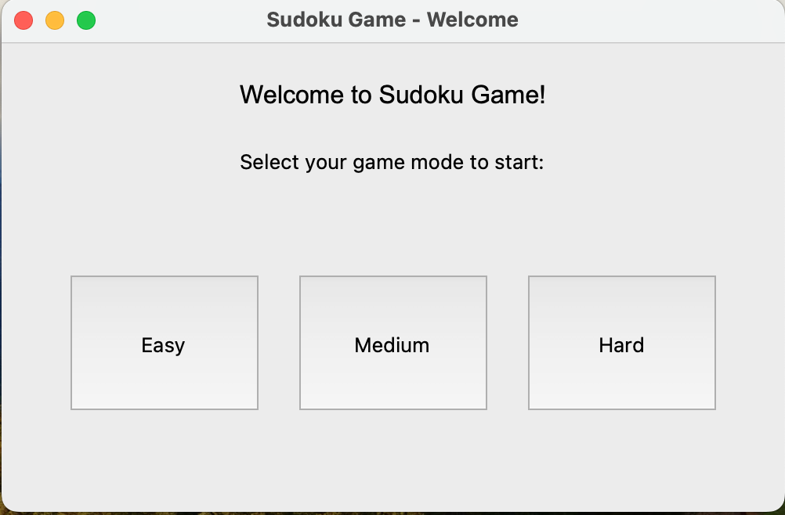

# Sudoku-Solver

## Overview

Welcome to my Sudoku Game project! This Python-based game allows users to play the classic Sudoku puzzle in a graphical user interface (GUI). They can also get a board through the command line and the corresponding solution. Sudoku is a popular logic-based puzzle game where players aim to fill a 9x9 grid with digits so that each column, each row, and each of the nine 3x3 subgrids contain all of the digits from 1 to 9 without repetition.

## How I made it
**Tech Used:** Python3, Tkinter, Requests, and NumPy

### Backend Development
- Researched and integrated a Sudoku API for fetching different Sudoku boards to enable varied testing scenarios.
- Implemented the backend logic using backtracking solve different Sudoku puzzles fetched from the API
- Conducted thorough testing to identify and resolve bugs in the backend code.

### Frontend Development
- Developed the `game.py` module to create the core gameplay functionality, focusing on user interaction and puzzle solving.
- Created the `landing_page.py` module for the initial user interface, overcoming challenges with difficulty selection by switching to a more suitable API.
- Expanded the frontend with `ending_page.py` to congratulate them on solving the puzzle, while displaying their game stats.

### Testing and Refinement
- Conducted extensive testing across different settings and scenarios to ensure the functionality and usability of the GUI.
- Iteratively refined the project based on user feedback and personal testing, addressing any issues or inconsistencies encountered.

### Conclusion
- Completed the project after thorough testing and validation of the GUI functionality and user experience.
- Reviewed the project from start to finish to ensure all components and features were implemented successfully.

## Usage

### GUI Instructions
To play the game through the GUI follow these steps: 
1. Make sure you have python3 installed (this can be verified by typing `python3 --v` )
2. Clone the repo using `git clone`
3. run the game by typing `python3 landing_page.py` in the command line, while in the root directory. You should see a page like this:

4. Follow the instructions given through the GUI

### Command Line Instructions
To run the program through the command line follow these steps:
1. Follow steps 1 and 2 from the GUI instructions
2. run the program by typing `python3 solver.py` in the command line, while in the root directory
3. Follow the instructions given through the command line

### Running the Tester:
To run the tester follow these steps:
1. Follow steps 1 and 2 from the GUI instructions
2. run the tester file by typing `python3 -m unittest tester.py` in the command line, while in the root directory
